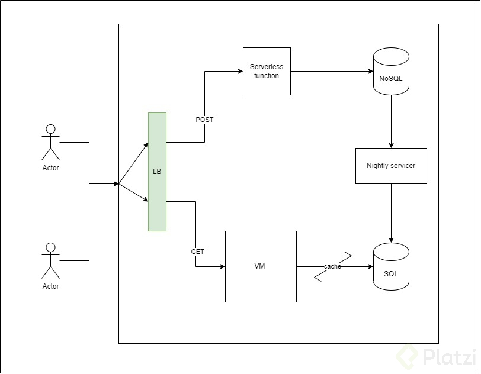
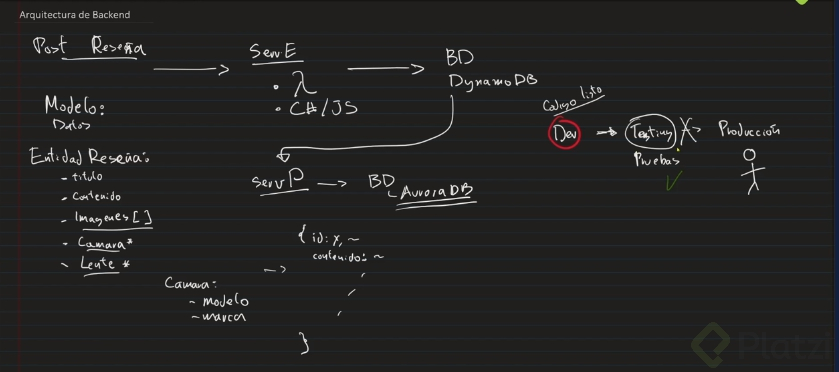
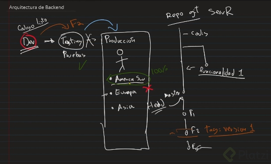

# Titulo: CameraReviews System
---
## Problema a resolver
La empresa "RandomCameraReviews" necesita un sistema que permita que fotografos profesionales suban "reviews" de Camaras fotograficas, para que cualquier persona desde cualquier parte del mundo pueda buscar los los reviews y comprarlas a travez de su portal.
La empresa cuenta con un equipo de developers especializado en frontEnd que realizara un portal para que los editores suban los "reviews" y los usuarios puedan verlos, y han solicitado que tu como especista en Backend, les proporciones un sistema, incluyendo API que permita  realizar lo siguiente:

* Subir reviews de Camaras fotograficas
* Obtener el contenido de los reviews para mostrarlo en vistas del portal en sus versiones web y mobile.
* Manejo de usuarios para editores (no incluye visitantes que leen los reviews)

Tambien se sabe que la empresa "RandomCameraReviews" planea distribuir mayormente en America del Sur donde esta su mercado mas grande, pero tambien tienen ventas en norte america, Europa, y muy pocas en Asia.

### Alcance(Scope)
Descripción..

#### Casos de uso
* Como editor me gustaría poder subir una review de una camara
* Como editor me gustaría poder subir una review de una lente para camaras
* Como usuario me gustaría solamente ver el contenido de las camaras existente
* Como usuario me gustaría poder visualizar detalles del editor como el nombre, publicaciones, reviews, etc
* Como usuario no registrado me gustaría poder leer una review de una camara
* Como editor me gustaría ver cuantas visualizaciones tiene la review de una camara

#### Casos de uso No Soportados
* Como usuario no registrado me gustaría poder subir una review de una camara
* Como editor no podria ver la persona que vio la review de la camara publicada
* Como usuario no puedo hacer un registro o inicio de sesión
* Como usuario no puedo guardar esa review de una camara

---
## Arquitectura

### Diagramas
```poner diagramas de secuencia, uml, etc```
---


### Modelo de datos
```Poner diseño de entidades, Jsons, tablas, diagramas entidad relación, etc..```
---


---
### Plan de pruebas
* Crear proyecto de pruebas que valide los siguientes casos de uso.
- Registrar usuario, crear review, simular que visitante puede leer el review escrito (Test: End to End)

### Integración continua
---


---
## Limitaciones
Lista de limitaciones conocidas. Puede ser en formato de lista.
Ej.
* Llamada al API que permite subir una review, no excede los limites de latencia 500ms
* Llamada al API que permite obtener reviews para lectura deben de tener una latencia menor a 100ms
---
## Costo
Descripción/Análisis de costos
Contemplado 1000 usuarios diarios, que visitan recurrentemente cada hora:
Ejemplo:
"Considerando N usuarios diarios, M llamadas a X servicio/baseDatos/etc"
* 1000 llamadas diarias a serverless functions. $XX.XX
* 1000 read/write units diarias a X Database on-demand. $XX.XX
Total: $xx.xx (al mes/dia/año)

---

```
Realizar diagramas:
https://www.diagrams.net/

Realizar casos de uso:
https://sequencediagram.org/
```